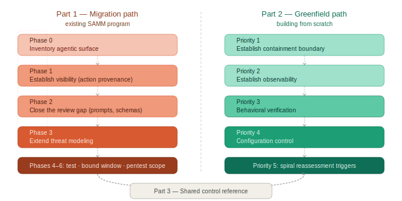

# Agentic SAMM — An OWASP SAMM Extension for AI-Driven Development

> **Author:** Sergey Gordeychik · CyberOK · scadastrangelove@gmail.com · 2026
> **License:** [CC BY-SA 4.0](LICENSE.md) — cite as: Gordeychik, S. (2026). *Agentic SAMM*. CyberOK.

---

*Figure 5: Both paths share the same destination — the shared control reference — but start from different premises.*

# Part 2 — Greenfield Path

> **v0.2 addition:** For structured audit methodology, see `audit/auditor-process.md`. The audit process defines three tracks (Track A self-audit, Track B independent, Track C agent-as-code-auditor), required phase gates (mission interview before technical inventory), and prompt libraries for systematic data collection.

*For teams building agentic systems without a pre-existing SAMM-aligned security program*

A greenfield path is shorter than a migration path not because agentic systems are simpler, but because they are not constrained by inherited assumptions. A new program does not need to preserve control evidence built for a non-agentic boundary. It can begin from the correct premise: the system being secured includes not only software artifacts and deployment infrastructure, but also context flows, tool boundaries, delegated authority, approval checkpoints, and runtime behavior.

The goal of the greenfield path is not completeness on day one. It is to establish a minimum secure baseline that bounds blast radius early, creates observability before scale, and can be extended at each turn of the development spiral as the system gains autonomy, tools, and operational reach.

A control that cannot be re-scoped as the agent gains new tools or autonomy is not a greenfield control. It is a future migration problem.

## 2.1 Greenfield Design Principles

**Start with bounded agency, not maximum capability.**
Do not begin by exposing the agent to every available tool and then trying to constrain it afterward. Start from the smallest useful tool surface, the shortest autonomy window, and the lowest available blast radius. Expand only when observability and control maturity justify it.

**Establish observability before optimization.**
A system that cannot explain what context influenced a decision, what tool was invoked, and what approval boundary was crossed is not ready for autonomy tuning. Logging and provenance are not operational polish. They are the prerequisite for all later assurance.

**Treat every new tool as a new trust boundary.**
Adding a tool is not equivalent to adding a helper function. It is equivalent to adding a new delegated authority surface with its own threat model, failure modes, and containment needs.

**Design for reviewable autonomy.**
The question is not whether humans remain in the loop in principle. The question is whether the number, timing, and quality of checkpoints are realistic relative to action volume and blast radius. If human review cannot keep up, the checkpoint is nominal rather than effective.

**Assume reassessment at the next spiral turn.**
Every autonomy increase, tool addition, connector addition, or context-source expansion must trigger re-evaluation of the system's threat model, autonomy window, and temporal blast radius.

## 2.2 Minimum Secure Baseline

A greenfield agentic system should not go live without the following baseline controls in place.

**1. Inventory the agentic surface.**
Before defining controls, enumerate what exists: agents and orchestrators, system prompts and policy prompts, memory and state stores, context sources, tools and MCP servers and connectors, approval checkpoints, high-blast-radius actions, and execution boundaries. If this inventory does not exist, the system does not yet have a defined assurance boundary.

**2. Bound the execution boundary.**
All agent-executed actions should run in a constrained environment by default. The design must define where tools execute, what filesystem and network access they have, what secrets are accessible, what actions are irreversible, and what policy is enforced when a boundary is crossed. A sandbox is not an optimization. It is the primary containment mechanism for misaligned or compromised agent behavior.

**3. Minimize delegated authority.**
The agent should not operate under a broad fixed scope if narrower task-bounded scopes are possible. Define which tools are always allowed, which require approval, which are prohibited, what scope each tool receives, and what actions require a stronger checkpoint.

**4. Require action provenance.**
For each security-relevant agent action, record: context source and trust level, selected tool, task or plan reference, approval event if any, scope exercised, sandbox or execution policy applied, and resulting side effect or external destination.

**5. Define behavioral test cases before production.**
The minimum requirement is a behavioral test suite that exercises the main threat classes: context injection, tool abuse, autonomy-window exploitation, and supply-chain-relevant configuration tampering.

**6. Put prompts, schemas, and configs under security review.**
Prompts, tool schemas, MCP definitions, connector configs, and policy artifacts must be treated as reviewable security-relevant assets. If they can change outside the normal review path, the system has a structural control gap from day one.

## 2.3 Priority-Ordered Greenfield Controls

Ordered by likelihood × blast radius, with preference for controls that both reduce immediate harm and improve the quality of future assurance evidence.

**Priority 1 — Establish the containment boundary.**
Implement isolated execution for tools, a basic tool allow/deny policy, explicit approval for destructive or irreversible actions, and secret minimization inside the agent execution boundary. This comes first because it limits the immediate consequences of Context Injection, Tool Abuse, and Autonomy Window Exploitation regardless of how mature the team's verification or governance processes are.

**Priority 2 — Establish observability.**
Implement action provenance logging, context provenance metadata, tool-call logging into the security monitoring pipeline, and periodic review of intent–action gap. This comes second because a system that cannot observe its own decisions cannot safely tune autonomy, expand tooling, or interpret failures.

**Priority 3 — Establish behavioral verification.**
Implement behavioral test cases for context injection, tool abuse, ambiguous-task execution, unsafe action chaining, and high-blast-radius workflows. This comes before configuration-control maturity because the team must first learn whether the system behaves safely under realistic adversarial or misaligned conditions. Process control over changes is necessary, but it is less useful if the organization still lacks evidence about what safe behavior looks like.

**Priority 4 — Establish reviewable configuration control.**
Once behavioral expectations are defined, bring system prompts, tool schemas, MCP definitions, connector configs, and policy artifacts under explicit security review. At this stage the goal is not only to control change, but to ensure that changes are reviewed against a known behavioral baseline rather than against syntax or policy alone.

**Priority 5 — Establish spiral reassessment triggers.**
Define mandatory reassessment whenever the agent receives a new tool, broader scope, a longer autonomy window, new external context sources, persistent memory, or access to higher-blast-radius environments. This is where the spiral becomes operational rather than conceptual.

## 2.4 Greenfield False Starts

A greenfield program avoids legacy assumptions but creates a different risk: teams confuse design intent with effective control. The following are common failure modes in early agentic programs.

The first three concern runtime controls; the second three concern assurance and control-process failures. Both categories produce the same result: assurance that exists on paper rather than in evidence.

---

**"We designed containment, therefore containment exists."**
A sandbox boundary described in architecture is not equivalent to a sandbox boundary enforced at runtime. Teams often specify constrained execution but fail to verify filesystem, network, or process escape paths under actual tool behavior.

---

**"We added approval checkpoints, therefore humans remain in control."**
A checkpoint is only effective if human reviewers can realistically evaluate the volume, pace, and consequence of actions presented to them. When action volume exceeds review capacity, the checkpoint becomes nominal rather than effective.

---

**"We limited agent scope, therefore least privilege is satisfied."**
Session-wide authority is often relabeled as acceptable because the system is still early-stage. In practice this creates immediate privilege debt: the agent may hold permissions reasonable in aggregate but excessive for any given task.

---

**"We have provenance logs, therefore behavior is explainable."**
Many systems log actions without logging the context source, trust level, approval boundary, or policy evaluation that led to the action. This creates traceability theater rather than usable assurance.

---

**"We review prompts and configs, therefore behavioral risk is covered."**
Review of prompts, schemas, and configuration files is necessary, but without behavioral verification it only proves that artifacts passed a process gate. It does not prove that the resulting system behaves safely.

---

**"We added tools incrementally, therefore the threat model remained current."**
Tool growth is often treated as ordinary feature expansion. In agentic systems, every new MCP server, connector, or execution-capable tool is a new trust boundary and should trigger explicit reassessment.

## 2.5 Greenfield Spiral Check

At the end of each development iteration, before expanding autonomy or tool surface:

1. What new context sources can now influence the agent?
2. What new tools or connectors can it invoke?
3. Has the autonomy window changed?
4. Has the temporal blast radius increased?
5. Are action provenance and review checkpoints still sufficient for the current action volume?
6. Did any new inherited assumptions enter the system through convenience or scale?

If the answer to any of these is yes, revisit the relevant design, verification, and operations controls before expanding further.

## 2.6 Greenfield Readiness Assessment

A greenfield system that has infrastructure, prompts, tools, and tests, but cannot demonstrate containment, provenance, and action-bounded authority, is feature-complete before it is security-complete.

A system is ready for scaled use only when the following outcomes are demonstrably true — not merely present in design or process documentation.

| Outcome | Readiness question |
|---|---|
| **The agentic surface is known** | Can the organization enumerate agents, tools, MCP servers, prompts, schemas, configs, and memory stores without relying on tribal knowledge? |
| **Containment is real, not assumed** | Can the organization demonstrate that agent-executed tools are bounded by an enforced execution policy rather than only architectural intent? |
| **Authority is bounded at action level** | Can the organization show that high-risk actions require narrower scope or stronger checkpoints than low-risk actions? |
| **No security-critical artifact can change without review** | Can any prompt, schema, MCP definition, connector config, or policy artifact be deployed without passing through an approved review path? |
| **Behavior is tested, not inferred** | Does the system have repeatable behavioral tests for the primary threat classes rather than relying only on unit, integration, or DAST-style evidence? |
| **Actions are reconstructable** | For any security-relevant action, can the team reconstruct the triggering context, selected tool, approval event, exercised scope, and resulting side effect? |
| **Human checkpoints are effective** | Can the organization show that action volume and timing remain within realistic human review capacity for high-blast-radius operations? |
| **Capability growth triggers reassessment** | Is there a defined trigger that forces reassessment when autonomy, tool surface, context surface, or blast radius increases? |

This assessment asks for evidence of state, not evidence of process. A team may have review, logging, or approval mechanisms on paper and still fail if those mechanisms do not produce the required security outcome.

---
---

## 2.7 Audit Methodology Reference *(v0.2)*

The structured audit methodology introduced in v0.2 is in `audit/auditor-process.md`. It defines:

- **Three audit tracks:** Track A (self-audit by the development agent), Track B (independent audit by a separate auditor), Track C (agent-as-code-auditor reviewing a codebase it did not build)
- **Phase gates:** Phase 1 (Mission Interview) must complete before Phase 2 (Data Collection) begins — this is a hard requirement, not a recommendation
- **Evidence hierarchy:** [empirical] > [config] > [inferred] > [unknown]; [empirical absence] is distinct from [unknown]
- **Shared responsibility framing:** cloud-hosted agent controls are split into user-side, vendor-side, and structural categories before grading
- **External verification pass (Phase 4.5):** mandatory for all Track A audits; without it, the report is draft only

**The single most common audit failure:** starting with technical inventory before completing the mission interview. Blast radius cannot be correctly assigned without knowing what the owner cannot afford to lose. Findings discovered through technical inventory alone cannot be prioritized without re-interviewing the owner.

Quick-start guidance for greenfield teams:

| If you need... | Go to |
|---|---|
| Structured audit process with all phases | `audit/auditor-process.md` |
| Prompts for systematic data collection | `audit/prompt-library.md` |
| Environment-specific verification commands | `audit/environment-adapters.md` |
| Blank report template | `audit/report-template.md` |
| Multi-environment comparison protocol | `audit/comparative-audit-protocol.md` |
| Analysis principles and anti-patterns | `audit/analysis-principles.md` |
| Real-world audit example | `examples/claude-ai-zhet-audit-2026.md` |
