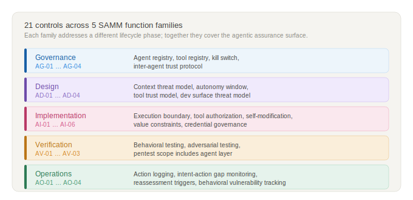

# Part 3 — Shared Control Reference

This section is the reference layer of the framework. It defines controls applicable to both migration and greenfield programs, organizes them by SAMM function, specifies maturity levels, and maps them to external frameworks. It is intended as a working tool, not a compliance checklist.

*Figure 9: The 21 controls span five SAMM function families — Governance, Design, Implementation, Verification, and Operations. Each family addresses a different lifecycle phase; together they cover the full agentic assurance surface.*

## 3.1 How to Read the Matrix

### Maturity levels

| Level | Meaning |
|---|---|
| **L1** | The control exists and is manually applied at key boundaries |
| **L2** | The control is standardized, repeatable, and consistently evidenced |
| **L3** | The control is measured, adaptive, and triggers reassessment as the system evolves |

L1 is the floor, not the goal. A program at L1 across all controls has defined its boundary and can demonstrate it exists. A program at L3 has instrumented that boundary and uses it to drive decisions about autonomy expansion.

*Figure 4: L1 establishes that a control exists and is applied. L2 makes it repeatable with tracked evidence. L3 makes it adaptive — metrics drive decisions and capability changes trigger reassessment.*

### Evidence vs. process

Throughout the matrix, the Evidence column specifies what proves a control is real, not merely documented. A control that exists in policy but cannot be demonstrated should be treated as L0 for practical assessment, regardless of its formal status.

The distinction that matters: **process says the control is applied; evidence shows the effect of applying it**. For agentic controls this distinction is especially important, because many failure modes — nominal approval checkpoints, undocumented tool surface, architectural sandbox that is not enforced at runtime — produce green process metrics over uncovered risk.

### Column definitions

| Column | Meaning |
|---|---|
| **ID** | Stable short identifier for cross-referencing |
| **Control** | Plain-English name |
| **SAMM function** | Primary SAMM function this control extends or introduces |
| **Threat coverage** | Which taxonomy classes this control addresses (C1–C4, W1, W2, E1–E3) |
| **L1** | Minimum viable implementation |
| **L2** | Managed, repeatable, consistently evidenced |
| **L3** | Measured, adaptive, triggers spiral reassessment |
| **Evidence** | What demonstrates the control is real |
| **Path** | M = Migration, G = Greenfield, B = Both |

---

## 3.2 Control Matrix

The controls below are written as reference controls; teams should adapt implementation detail to system autonomy, tool surface, and blast radius.

### Family 1 — Governance

---

**AG-01 — Agent Registry and Autonomy Classification**

SAMM function: Governance | Threat coverage: C3, W1 | Path: B

| Level | Implementation |
|---|---|
| L1 | Agents are enumerated with owner, tool set, and autonomy level documented in a maintained register |
| L2 | Autonomy levels are formally classified (e.g., supervised / semi-autonomous / autonomous); each classification defines its review requirements |
| L3 | Autonomy level changes require formal re-classification; classification is reviewed at each spiral turn and after any capability increase |

Evidence: agent registry exists and is current; each entry has a named owner; autonomy level is documented and matches deployed configuration.

*Trust grading in the agent registry.*

Autonomy classification alone is insufficient. An agent may be classified as semi-autonomous and still be an F-grade source — newly deployed, behaviorally untested, with no operational track record. The agent registry should record both autonomy level and trust rating (see §0.6). Autonomy expansion requires trust rating improvement, not only technical capability demonstration. An agent cannot hold higher autonomy than its trust rating supports.

---

**AG-02 — Tool Registry Governance**

SAMM function: Governance | Threat coverage: C2, C4 | Path: B

| Level | Implementation |
|---|---|
| L1 | All tools and MCP servers available to the agent are enumerated with owner and access policy |
| L2 | Tools are classified by risk tier (always allowed / conditionally allowed / prohibited); conditional tools have defined approval requirements |
| L3 | Tool registry is versioned; additions trigger automated threat model review; removal of unused tools is tracked and enforced |

Evidence: tool registry exists; each entry has owner and risk classification; prohibited tools cannot be invoked without explicit exception; registry is included in security review scope.

---

**AG-03 — Kill Switch and Escalation Ownership**

SAMM function: Governance | Threat coverage: C3 | Path: B

| Level | Implementation |
|---|---|
| L1 | A named owner can halt any agent's execution; halt procedure is documented and tested |
| L2 | Kill switch can be invoked without requiring production access; escalation path covers out-of-hours scenarios |
| L3 | Kill switch invocation is logged and reviewed; partial-halt capabilities exist (halt specific tools or autonomy scope without full shutdown) |

Evidence: kill switch owner is identifiable; halt was tested in the last cycle; escalation path is current and does not depend on a single individual.

*Decommissioning.* *(v0.3)*

AG-03 covers emergency halt. Orderly decommissioning is a separate concern: persistent state cleanup, credential revocation, downstream system notification, and data retention compliance. At L2, a decommissioning procedure should be documented alongside the kill switch, covering: purging cross-session persistent memory (AI-04 surfaces), revoking delegated credentials and tokens, notifying downstream consumers that depend on the agent's outputs, and confirming data retention obligations are met. For self-modifying agents, decommissioning includes verifying that no agent-written state persists in shared resources (repos, config files, project instructions) beyond the agent's operational lifetime.

---

**AG-04 — Inter-Agent Trust Protocol** *(v0.3 — new control)*

SAMM function: Governance | Threat coverage: C1, C4, W2 | Path: B

In multi-agent systems — orchestrators, subagent spawning, agent-to-agent delegation — each inter-agent communication channel is a trust boundary. Without authentication and integrity controls on these channels, a compromised or spoofed agent can inject instructions, exfiltrate data, or redirect goals across the agent graph. AG-01 enumerates agents; AG-04 governs how they communicate.

| Level | Implementation |
|---|---|
| L1 | Inter-agent communication channels are enumerated; each channel has a documented trust assumption (authenticated / unauthenticated, integrity-checked / unchecked); agents can identify the source of incoming messages |
| L2 | Inter-agent messages carry provenance metadata (source agent ID, trust grade, session context); agents reject or quarantine messages from unrecognized sources; delegation chains are logged with provenance |
| L3 | Inter-agent trust is enforced cryptographically or via protocol-level controls; message integrity is verified before processing; anomalous inter-agent communication patterns trigger alerts |

Evidence: channel inventory exists; at L1: trust assumptions documented per channel; at L2: provenance metadata format defined and populated in logs; delegation chain reconstructable from logs; at L3: integrity verification mechanism demonstrated.

**Scope:** This control applies when agents can send instructions, context, or tool invocation requests to other agents — whether through explicit APIs, shared memory, message queues, or indirect channels (shared files, repos). Single-agent systems may mark this control as N/A.

---

### Family 2 — Design

---

**AD-01 — Context Threat Modeling**

SAMM function: Design | Threat coverage: C1, W1 | Path: B

| Level | Implementation |
|---|---|
| L1 | Threat model includes at least one context flow diagram identifying external content sources and their trust levels |
| L2 | All context sources are classified by trust level; threat paths for indirect and persistent context injection are explicitly modeled |
| L3 | Context threat model is updated at each spiral turn; new context sources require threat model amendment before integration |

Evidence: threat model document includes context flow diagrams; each source carries a trust classification; injection threat paths are present in the model, not only in generic notes.

---

**AD-02 — Autonomy Window Assessment**

SAMM function: Design | Threat coverage: C3 | Path: B

| Level | Implementation |
|---|---|
| L1 | Autonomy windows are identified for the system's primary workflows; maximum duration between effective human checkpoints is documented |
| L2 | Temporal blast radius is estimated per autonomy window; checkpoints are designed relative to blast radius, not only workflow convenience |
| L3 | Autonomy window metrics are instrumented; actual checkpoint frequency is compared against designed frequency; deviations trigger review |

Evidence: autonomy windows are documented; blast radius estimates exist; checkpoint design references these estimates explicitly.

*Auftragstaktik and the design of autonomous action.*

Prussian military doctrine introduced the concept of *Auftragstaktik* — mission-type tactics — in the 19th century as a solution to a problem that remains unsolved in most agentic systems: how do you maintain coherent, aligned behavior across a distributed force when communications are unreliable, the situation changes, and no plan survives first contact? Helmuth von Moltke the Elder captured it in 1869: *"Kein Operationsplan reicht mit einiger Sicherheit über das erste Zusammentreffen mit der feindlichen Hauptmacht hinaus"* — no plan of operations extends with any certainty beyond the first encounter with the enemy's main force.

Auftragstaktik's answer was not more detailed orders. It was better-internalized intent. A commander specifies the *Auftrag* (mission objective and its rationale), the *Ressourcen* (available means), and the *Raum* (boundaries of discretion). Subordinates act autonomously within those boundaries, using judgment to achieve the objective when the plan no longer fits the situation.

The mapping to agentic systems is direct. A system prompt is an Auftrag, not an algorithm. Tool access is Ressourcen. The autonomy window is Raum. Security is not achieved by enumerating every prohibited action — it is achieved by the agent understanding the objective well enough to act correctly when the context deviates from what the prompt anticipated. An agent that executes a prompt injection payload is not just exploited; it has failed its Auftrag.

The autonomy window assessment should therefore ask not only "how long before a checkpoint" but "how well does the agent understand the mission intent well enough to resist adversarial deviation from it."

*Autonomy tiers.* *(v0.3)*

The Auftragstaktik mapping produces five delegation tiers, from no delegation to full autonomous operation:

| Tier | Name | Checkpoint model | Example |
|---|---|---|---|
| 0 | Manual | No delegation | Kill switch exercised; human-only |
| 1 | Supervised | Per-action | claude.ai interactive: 1 response = 1 checkpoint |
| 2 | Guided | Per-sequence | Claude Code with scope hooks; scoped CI job |
| 3 | Bounded | Periodic | Overnight batch with hourly checkpoint |
| 4 | Autonomous | Exception-only | Production agent with continuous monitoring and auto-halt |

The effective autonomy tier is determined by three independent ceilings — the minimum of the three applies:

**Effective Tier = min(Mission Ceiling, Risk Ceiling, Trust Ceiling)**

No ceiling can be overridden by another. An A1-trusted agent on a Critical-risk action path is still Tier 1. A perfectly specified mission with an F6 agent is still Tier 0.

*Mission Ceiling* is derived from three inputs, each scored 1–3:

| Input | 1 (low) | 2 (medium) | 3 (high) |
|---|---|---|---|
| **Auftrag clarity** | Vague goal, no success criteria | Goal defined, success criteria partial | Goal + success + failure criteria explicit |
| **Rahmen completeness** | Implicit only (alignment training) | Partially documented (some constraints) | Fully explicit, enforcement types specified, risk-accepted (AI-05 L2) |
| **Enforcement coverage** | All behavioral ("will not") | Mixed — ≥1 critical constraint technical | Comprehensive — all critical constraints technical ("cannot") |

Mission Ceiling = tier from min(Auftrag, Rahmen, Enforcement): value 1 → Tier 1, value 2 → Tier 3, value 3 → Tier 4.

*Risk Ceiling* is derived from temporal risk tier of the highest-risk available action path: Critical → Tier 1, High → Tier 2, Moderate → Tier 3, Low → Tier 4.

*Trust Ceiling* is derived from agent source reliability grade (§0.6): F → Tier 0, E → Tier 1, D → Tier 2, C → Tier 3, B/A → Tier 4.

The **binding ceiling** identifies what constrains the system — and therefore what to fix: Mission binding → improve Auftrag/Rahmen/Enforcement. Risk binding → reduce blast radius. Trust binding → invest in evidence for trust promotion. Per-path differentiation is possible when AI-03 enforces per-task scope: each action path can operate at its own tier while the session default is set by the highest-risk available path.

The supplemental registry (§3.5) tracks the planned *Delegation Model* appendix for promotion prerequisites per tier, worked examples, and per-path assessment templates.

*Composite blast radius in multi-agent systems.* *(v0.3)*

When multiple agents operate in a graph — orchestrators delegating to subagents, pipelines passing outputs between stages — blast radius must be assessed across agent boundaries, not only per agent. Agent A with Moderate blast radius delegating to Agent B with access to Tool C creates a composite path whose blast radius may be Critical even though no single agent's assessment shows it. At L2, the blast radius matrix should include composite paths through the agent graph, with the assessment driven by the highest-blast tool reachable through any delegation chain.

*Mission-centric blast radius.*

Standard blast radius assessment asks how much damage a compromised action causes. Mission-centric assessment asks a more precise question: **does the damage prevent mission completion, and can the mission state be recovered?**

This distinction matters because CIA-centric assessments produce wrong priorities. Code leaking from a public repository is a low-severity event in mission terms even if it scores high on confidentiality impact. An unauthorized push to a protected branch is a high-severity event even if the pushed content is benign, because it compromises mission integrity and may be irreversible within the operational window.

Mission-centric blast radius assessment uses three dimensions:

| Dimension | Question | Grades |
|---|---|---|
| **Mission impact** | Does this action, if wrong, prevent achieving the task objective? | Critical / Significant / Marginal / None |
| **Recovery envelope** | Can mission state be restored, and in how long? | Immediate / Minutes / Hours / Irreversible |
| **Lateral mission impact** | Does this affect concurrent agents or downstream tasks? | None / Adjacent / Cross-domain |

Approval gating requirements follow from position in this space, not from a generic "high/medium/low" label. An action that is Critical × Irreversible × Cross-domain requires a hard checkpoint regardless of how routine it appears in isolation.

*Agentic asset criticality dimensions.* *(v0.3)*

Standard confidentiality/integrity/availability assessment is necessary but insufficient for agentic assets. Two additional dimensions address risks specific to agent-operated systems:

**Cross-session persistence (P):** damage from corruption that propagates across sessions without detection. Relevant for memory stores, project instructions, config files the agent reads on startup. Assets with P=high (persists, influences behavior, not regularly reviewed) require elevated scrutiny — silent corruption propagates indefinitely.

**Downstream trust inheritance (D):** do downstream consumers of this asset's content treat it as ground truth without independent verification? When D=high (downstream systems consume without re-verification), the asset's effective blast radius extends beyond its direct scope into every system that trusts its outputs. This is the pipeline amplification effect.

Both dimensions should be assessed alongside standard C/I/A when populating the blast radius matrix. The supplemental registry (§3.5) tracks the planned *Asset Criticality and Blast Radius Guide* for scoring guidance and worked examples.

This approach was first articulated for industrial control systems by Gordeychik, Gapanovich, and Rozenberg (2016) in the context of railway signalling security: CIA-based assessment systematically underestimates risk to safety-critical systems because it measures information properties rather than operational consequences. The same principle applies to agentic systems operating in production environments.

---

**AD-03 — Tool and Connector Trust Modeling**

SAMM function: Design | Threat coverage: C2, C4 | Path: B

| Level | Implementation |
|---|---|
| L1 | Each MCP server and connector is included in the system's trust boundary model with a defined trust level |
| L2 | Tool invocation paths are modeled as trust boundaries; confused-deputy and chain-exploitation threat paths are explicitly addressed |
| L3 | Trust model is updated when tools are added, modified, or replaced; supply-chain threat paths for tool infrastructure are included |

Evidence: trust boundary model includes tool layer; tool entries have trust classifications; threat paths cover tool abuse scenarios.

---

**AD-04 — Development-Surface Threat Modeling**

SAMM function: Design | Threat coverage: C1, C2, C4, E3 | Path: B

| Level | Implementation |
|---|---|
| L1 | Development-time tooling — IDE plugins, LSP extensions, local MCP servers, pre-commit hooks, CI-integrated agents — is enumerated and included in at least one threat model |
| L2 | Development-surface threat model identifies privileged access paths, secret exposure risks, and injection vectors present during development but not production; mitigations are defined |
| L3 | Development-surface threat model is reviewed at each spiral turn; new development tooling requires threat model amendment; development-time sandboxing is assessed separately from production sandboxing |

Evidence: threat model document explicitly covers development tooling; development-surface attack paths are listed separately from production paths; at least one control addresses development-specific risk.

*Self-modifying agents: when dev IS prod.* *(v0.3)*

AD-04 assumes a separation between the development surface (where the agent assists) and the production artifact (what gets deployed). For self-modifying agents — systems that write their own code in the same runtime they operate in — this separation does not exist. The development surface IS the production runtime. A successful prompt injection during a self-modification cycle produces persistent cross-restart code changes with production impact. For this architecture class, AD-04 must be applied as a single-surface assessment using the higher blast radius of either context, and self-modification events should be treated with the same scrutiny as production deployments.

---

### Family 3 — Implementation

---

**AI-01 — Prompt and Schema Security Review**

SAMM function: Implementation | Threat coverage: C1, C4, W1 | Path: B

| Level | Implementation |
|---|---|
| L1 | System prompts, tool schemas, MCP server definitions, and agent config files are identified as security-critical and included in code review scope |
| L2 | Changes to these artifacts require security-aware review; reviewers are trained on prompt injection and schema poisoning risks |
| L3 | Automated diff analysis flags high-risk changes (new tool permissions, modified trust boundaries, constraint relaxations) for mandatory security review |

Evidence: no security-critical agentic artifact can be deployed without appearing in the review queue; reviewer training covers prompt and schema risk; rejected changes are logged.

---

**AI-02 — Execution Boundary Control**

SAMM function: Implementation | Threat coverage: C2, C3, W2 | Path: B

| Level | Implementation |
|---|---|
| L1 | All agent-executed tool calls run in a defined execution boundary; filesystem and network access is documented per tool |
| L2 | Default execution policy is isolation; host execution requires explicit justification and approval; sandbox policy is enforced, not merely described |
| L3 | Sandbox policy violations are logged and alerted; escape paths are tested in adversarial evaluation; development-time tooling is sandboxed separately from production |

Evidence: sandbox policy document exists and matches deployed configuration; network and filesystem access has been verified under actual tool behavior, not only architecture review; escape attempt tests have been run.

---

**AI-03 — Scoped Tool Authorization**

SAMM function: Implementation | Threat coverage: C2, W1 | Path: B

| Level | Implementation |
|---|---|
| L1 | Agents do not operate under session-wide maximum scope; at least high-blast-radius tools have narrower access |
| L2 | Tool scope is bounded per task or per invocation for conditional tools; broad scope requires explicit justification |
| L3 | Scope minimization is enforced programmatically; scope creep is detected and alerted; per-invocation scope is the default for all non-trivial tools |

Evidence: scope policy is documented per tool; high-blast-radius tools have demonstrably narrower access than the agent's maximum; scope assignments are reviewable.

---

**AI-04 — Agent Self-Modification Governance** *(v0.2)*

SAMM function: Implementation | Threat coverage: C1, W1 | Path: B

Any agent capability to write data that influences its own future behavior — persistent memory, scratch files, project instructions, system prompt extensions — creates a self-modification surface with cross-session blast radius. This surface is not covered by tool registry (AG-02) or execution boundary controls (AI-02). Self-modification surfaces that the user cannot audit must be treated as L0 regardless of agent self-report.

| Level | Implementation |
|---|---|
| L1 | All self-modification surfaces enumerated with cross-session flag; user-auditable mechanism exists for each (view command, UI panel, or API export) |
| L2 | Writes logged with provenance (session, tool call, content, timestamp); high-blast-radius writes require explicit user checkpoint before taking effect; user receives notification for autonomous writes to persistent state |
| L3 | Automated anomaly detection on self-modification patterns; unrecognized writes generate alerts; periodic automated review of persistent state against ground truth |

Evidence: enumeration document listing each surface with cross-session flag; user-auditable mechanism demonstrated (e.g., view command output); at L2: write log with provenance fields populated; notification mechanism confirmed.

**Note on self-report ceiling:** all claims about what an agent "will not write" to persistent memory are [inferred] by default. L2 requires external logging or a user-auditable mechanism — not agent self-report.

---

**AI-05 — Operational Value Constraint Mapping** *(v0.2)*

SAMM function: Implementation | Threat coverage: C3, W1 | Path: B

Operational value constraints — mission boundaries the agent must not cross — are simultaneously ethical statements and security controls. The critical distinction this control forces: **"will not" vs "cannot."**

- *Technical enforcement (cannot):* the behavior is physically impossible — verifiable independently.
- *Behavioral enforcement (will not):* governed by alignment training and runtime reasoning; can be overridden by adversarial context. A misaligned agent produces identical self-reports to an aligned one.

For security tooling deployed to clients, behavioral-only enforcement of "must not attack out-of-scope systems" is a materially different guarantee than a scope enforcement check that fails closed. This difference must be surfaced, not implied.

| Level | Implementation |
|---|---|
| L1 | Mission-critical constraints documented with explicit enforcement type (technical / behavioral) per constraint; blast radius if violated stated per constraint |
| L2 | Each constraint has a behavioral test case with pass/fail record; behavioral-only constraints on mission-critical boundaries are formally risk-accepted by the system owner with documented rationale |
| L3 | Automated adversarial testing for constraint violation scenarios at each release; behavioral-only constraints tracked as a security metric with trend monitoring |

Evidence: constraint inventory table with enforcement type and blast radius; at L2: behavioral test cases (probe + observed response + HOLDS/FAILS/AMBIGUOUS); formal risk acceptance record with owner and date.

---

**AI-06 — Agent Identity and Credential Governance** *(v0.3 — new control)*

SAMM function: Implementation | Threat coverage: C2, C3, W1 | Path: B

AI-03 governs what tools an agent can invoke per task. AI-06 governs the credentials that make those invocations possible: how tokens, keys, and delegated permissions are issued, scoped, rotated, and revoked. In multi-agent or multi-tool systems, credential delegation is the primary privilege escalation path — a compromised agent inherits every credential it holds.

| Level | Implementation |
|---|---|
| L1 | Credentials available to each agent are inventoried; credential scope (which systems, what permissions) is documented per agent; credentials are not shared across agents with different trust grades |
| L2 | Credentials are scoped to minimum required permissions per agent per task; token lifetime is bounded (short-lived preferred); credential rotation procedure exists and is tested; delegation chains are documented (which agent delegated which credential to which subagent) |
| L3 | Credential issuance and revocation are automated; delegation chains are logged with full provenance; anomalous credential usage (scope expansion, off-hours access, cross-agent token reuse) triggers alerts |

Evidence: credential inventory per agent; at L1: scope documented; at L2: rotation tested, delegation chains reconstructable; at L3: automated issuance/revocation demonstrated, anomaly detection active.

**Scope note:** For single-agent systems using a single API key, L1 may be satisfied by documenting that key's scope and confirming it does not grant permissions beyond the agent's operational need. The control becomes critical when: multiple agents share infrastructure, agents can delegate to subagents, or agents hold credentials to external systems (client APIs, cloud services, repositories).

---

### Family 4 — Verification

---

**AV-01 — Behavioral Test Coverage**

SAMM function: Verification | Threat coverage: C1, C2, C3, W1 | Path: B

| Level | Implementation |
|---|---|
| L1 | Behavioral test cases exist for at least one scenario in each primary threat class (context injection, tool abuse, autonomy-window exploitation) |
| L2 | Behavioral tests are integrated into CI; test results are tracked over time; regressions are treated as security defects |
| L3 | Behavioral test coverage is measured and reported; new threat scenarios are added when new tools or autonomy levels are introduced; adversarial test cases are maintained by a red team function |

Evidence: behavioral test suite exists and runs in CI; test cases map to threat taxonomy classes; failure history is tracked; coverage is reported separately from functional test coverage.

---

**AV-02 — Adversarial Prompt and Tool Abuse Testing**

SAMM function: Verification | Threat coverage: C1, C2, W1 | Path: B

| Level | Implementation |
|---|---|
| L1 | At least one adversarial context injection scenario has been tested against the system; tool abuse paths have been manually exercised |
| L2 | Adversarial testing is conducted on a defined schedule; scenarios cover indirect and persistent injection vectors; tool chain exploitation paths are included |
| L3 | Adversarial evaluation is conducted by a dedicated red team function; novel attack scenarios are introduced at each spiral turn; findings feed into constraint and behavioral test refinement |

Evidence: adversarial test results are documented; findings have remediation tracking; test scope covers both user-facing and retrieved-context injection paths.

---

**AV-03 — Pentest Scope Completeness**

SAMM function: Verification | Threat coverage: C1, C2, C3, C4 | Path: B

| Level | Implementation |
|---|---|
| L1 | Penetration test scope explicitly includes agent loop, at least one MCP server, and at least one connector |
| L2 | Pentest scope covers agent loop, full tool registry, connector layer, and development-time toolchain; prompt injection and tool abuse are included in methodology |
| L3 | Pentest findings are mapped to the agentic threat taxonomy; re-test covers behavioral regressions, not only code-level fixes |

Evidence: pentest scope document names agentic components; findings include behavioral attack results; scope has been updated since agentic components were introduced.

---

### Family 5 — Operations

---

**AO-01 — Action Provenance Logging**

SAMM function: Operations | Threat coverage: W2 | Path: B

| Level | Implementation |
|---|---|
| L1 | Agent actions are logged with at minimum: tool invoked, task reference, and timestamp |
| L2 | Logs include context source and trust level, approval event, scope exercised, and sandbox policy result; logs are ingested into the security monitoring pipeline |
| L3 | Provenance logs are structured and queryable; retention policy covers incident investigation needs; log integrity is protected against agent-writable modification |

Evidence: log records include all L2 fields; a sample incident can be reconstructed from logs without additional investigation; logs are present in the SIEM, not only in application storage.

---

**AO-02 — Intent–Action Gap Monitoring**

SAMM function: Operations | Threat coverage: W2, C1 | Path: B

| Level | Implementation |
|---|---|
| L1 | Periodic manual review of agent action logs identifies significant divergences between stated plan and actual tool invocations |
| L2 | Intent–action gap detection is partially automated; material divergences generate alerts for review |
| L3 | Intent–action gap is a first-class runtime security signal; thresholds are calibrated per agent and autonomy level; gap events trigger spiral reassessment when they indicate constraint failure |

*Observable detection patterns.*

Intent–action gap manifests in three distinct forms, each requiring different instrumentation:

- **Plan–tool divergence:** the agent declared a sequence of steps (read → summarize → report) but the actual tool call log shows a different sequence or additional tools not in the declared plan. Detectable by diffing declared task plan against tool invocation log.
- **Scope expansion:** the agent executed the declared plan but invoked tools outside the task's stated scope — accessing systems, files, or APIs not mentioned in the task framing. Detectable by comparing tool calls against the task's declared resource set.
- **Reasoning opacity:** the agent produced no explicit plan before acting, making divergence invisible without chain-of-thought logging. Systems without explicit plan declaration should treat any tool invocation whose purpose cannot be reconstructed from logs as a gap event by default.

Evidence: gap review process exists and is conducted on schedule; gap events are logged and tracked; at least one gap event has been investigated and closed with documented outcome.

---

**AO-03 — Spiral Reassessment Triggers**

SAMM function: Operations | Threat coverage: C3, W1 | Path: B

| Level | Implementation |
|---|---|
| L1 | A defined list of events triggers security reassessment: new tool added, autonomy window expanded, new external context source enabled |
| L2 | Reassessment events are logged; reassessment includes review of threat model, autonomy window, and behavioral test coverage |
| L3 | Reassessment is time-bounded; incomplete reassessments block capability expansion; reassessment outcomes are tracked against prior baselines |

Evidence: trigger list exists and is current; at least one reassessment has been completed and documented; capability expansion was blocked or conditioned on reassessment completion.

---

**AO-04 — Behavioral Vulnerability Tracking**

SAMM function: Operations | Threat coverage: W1, W2 | Path: B

| Level | Implementation |
|---|---|
| L1 | Unsafe agent behaviors that do not correspond to code defects are tracked as remediation items in the vulnerability management function |
| L2 | Behavioral vulnerabilities are classified by threat class and severity; remediation includes constraint update, behavioral test addition, and regression verification |
| L3 | Behavioral vulnerability backlog is reviewed at each spiral turn; repeat patterns trigger constraint architecture review; disclosure compression risk is assessed for behavioral findings |

Evidence: at least one behavioral vulnerability has been tracked and closed; closure includes a behavioral regression test; the vulnerability management function accepts non-CVE behavioral findings.

---

## 3.3 Framework Mapping

Control IDs are stable across minor versions of this framework. The mapping is directional — it shows functional alignment, not clause-level equivalence. Section identifiers reference:

- **NIST AI RMF:** AI RMF 1.0 (January 2023), Tables 1–4. See also NIST-AI-600-1 GenAI Profile (July 2024) for generative AI-specific mitigation actions aligned to the same subcategories.
- **NCSC Secure AI:** Guidelines for Secure AI System Development (NCSC/CISA, November 2023), 4 sections. See also UK Code of Practice for the Cyber Security of AI (DSIT, January 2025), 13 principles — a companion document with more granular provisions.
- **MCP Security:** MCP Specification Security Best Practices (current revision). See also CoSAI MCP Security (January 2026) for a comprehensive 34-threat taxonomy with NIST/ISO mapping.
- **OWASP ASI:** OWASP Top 10 for Agentic Applications 2026 (December 2025). Risk catalog; ASAMM provides the control and maturity layer.
- **OWASP AI Testing Guide:** Testing methodology for AI trustworthiness across application, model, infrastructure, and data layers. ASAMM treats it as a complementary verification input rather than a replacement for lifecycle controls.

| Control ID | SAMM Function | NIST AI RMF | NCSC Secure AI | MCP Security | OWASP ASI 2026 |
|---|---|---|---|---|---|
| AG-01 | Governance | MAP 1.2, GOVERN 2.1 | §1 Secure design | — | ASI10 (Rogue Agents) |
| AG-02 | Governance | GOVERN 5.1 | §2 Secure development | Tool trust, supply chain | ASI02 (Tool Misuse), ASI04 (Supply Chain) |
| AG-03 | Governance | GOVERN 1.7 | §4 Secure operation | — | ASI08 (Cascading Failures), ASI10 |
| AG-04 | Governance | GOVERN 2.1 | §2 Secure development | Server auth, transport | ASI07 (Inter-Agent Comms) |
| AD-01 | Design | MAP 1.5, 2.2 | §1 Secure design | — | ASI01 (Goal Hijack), ASI06 (Memory Poisoning) |
| AD-02 | Design | MAP 2.3 | §1 Secure design | — | ASI08 (Cascading Failures), ASI09 (Trust Exploitation) |
| AD-03 | Design | MAP 1.5 | §1 Secure design | Tool trust | ASI02 (Tool Misuse) |
| AD-04 | Design | MAP 1.5 | §1 Secure design | Server lifecycle | ASI04 (Supply Chain) |
| AI-01 | Implementation | MANAGE 1.3 | §2 Secure development | — | ASI01 (Goal Hijack) |
| AI-02 | Implementation | MANAGE 1.3 | §3 Secure deployment | Sandboxing, isolation | ASI05 (Code Execution) |
| AI-03 | Implementation | MANAGE 1.3 | §2 Secure development | Authorization, scoping | ASI02 (Tool Misuse), ASI03 (Privilege Abuse) |
| AI-04 | Implementation | MANAGE 1.3 | §1 Secure design | Server lifecycle | ASI06 (Memory Poisoning) |
| AI-05 | Implementation | GOVERN 1.4 | §4 Secure operation | — | ASI09 (Trust Exploitation) |
| AI-06 | Implementation | GOVERN 5.1 | §2 Secure development | Credential mgmt, OAuth | ASI03 (Privilege Abuse) |
| AV-01 | Verification | MEASURE 2.6 | §3 Secure deployment | — | ASI01, ASI02 |
| AV-02 | Verification | MEASURE 2.6, 2.7 | §3 Secure deployment | — | ASI01, ASI02 |
| AV-03 | Verification | MEASURE 2.7 | §3 Secure deployment | — | ASI01–ASI06 |
| AO-01 | Operations | MEASURE 2.8 | §4 Secure operation | Logging, provenance | ASI08 (Cascading Failures) |
| AO-02 | Operations | MEASURE 2.8 | §4 Secure operation | — | ASI10 (Rogue Agents) |
| AO-03 | Operations | GOVERN 1.7 | §4 Secure operation | — | ASI04 (Supply Chain) |
| AO-04 | Operations | MANAGE 2.4 | §4 Secure operation | — | ASI10 (Rogue Agents) |

**Coverage notes:**
OWASP ASI03 (Identity & Privilege Abuse) is addressed through AI-03 (tool authorization) and AI-06 (credential governance, v0.3). ASI07 (Insecure Inter-Agent Communication) is addressed through AG-04 (inter-agent trust protocol, v0.3). Both controls are new in v0.3 and require real-world audit validation.

OWASP AI Testing Guide coverage is intentionally indirect here: AITG supplies test methods and test scopes, especially for verification work under AV-01/AV-02/AV-03, while ASAMM supplies the control ownership model, maturity expectations, evidence discipline, and reassessment logic around those tests.

---

## 3.4 Agentic Vulnerability Lifecycle

Classical vulnerability lifecycle assumes a code defect with a CVE identifier, a patch, and a deployment window. For agentic systems, this model is incomplete in three ways: behavioral vulnerabilities have no CVE equivalent; the window between disclosure and weaponization is compressed by AI-assisted exploit development; and the "fix" may be a constraint update rather than a code change.

The following lifecycle applies to behavioral and constraint-level vulnerabilities in agentic systems.

**Discovery**
A behavioral vulnerability may be discovered through adversarial evaluation, production incident, intent–action gap monitoring, or external report. Unlike code vulnerabilities, behavioral vulnerabilities are often discovered through observed unsafe behavior rather than static analysis. Discovery must be accepted from non-CVE sources.

**Reproduction**
Reproduce the unsafe behavior in a controlled environment. Document the triggering context, the tool invocation sequence, the constraint or policy that failed, and the outcome. Reproduction confirms that the finding is real and scopes the blast radius.

**Behavioral classification**
Classify the finding against the threat taxonomy: which primary threat class does it exploit (C1–C4), which weakness overlay enabled it (W1 constraint failure, W2 assurance blindspot), and which ecosystem modifier affects urgency (E1 disclosure compression, E2 composite accountability, E3 development surface). Classification determines remediation approach and priority.

**Containment**
Apply immediate controls to reduce blast radius while permanent remediation is developed. Containment may include: restricting the relevant tool, reducing autonomy window, adding an explicit approval checkpoint, or disabling the context source that carried the injection payload.

**Remediation**
Remediation for a behavioral vulnerability is typically one or more of: constraint update (tighten policy or guardrails), tool scope reduction, context source trust reclassification, or behavioral test addition that would have caught the finding. Code changes may also be required but are often not sufficient alone.

**Regression verification**
Verify that the behavioral test suite now catches the finding. A remediated behavioral vulnerability with no regression test is treated as partially closed. The regression test becomes a permanent member of the behavioral test suite.

**Spiral reassessment**
A closed behavioral vulnerability is a reassessment trigger. Review: does this finding indicate a constraint gap that affects other agents or tools, does it change the autonomy window or blast radius assessment, and does it require updates to the threat model or tool registry governance. Close the spiral turn with updated documentation.

**A note on disclosure compression (E1)**
For agentic systems, the interval between public disclosure of a behavioral attack pattern and its adoption in active exploitation may be very short. Teams should treat novel behavioral attack classes — new prompt injection techniques, new tool abuse patterns — with the urgency of a critical CVE even when no CVE exists. The absence of a CVE identifier does not indicate low severity. It indicates an immature classification system.

---

## 3.5 Supplementary Materials Registry

The following companion documents extend the framework with implementation guidance, templates, and worked examples. They are not part of the normative standard — the models and controls in Parts 0–3 are self-contained. Supplementary materials help teams *realize* decisions the standard defines.

Items without the *(planned)* marker already exist in the repository today. Items marked *(planned)* are candidates for future versions and do not yet exist.

**When the standard changes, review this registry.** Each entry notes which sections it depends on. A change to a referenced section may invalidate or require updates to the supplementary material.

| Document | Purpose | Depends on | Update trigger |
|---|---|---|---|
| **Trust Grading Calibration Guide** | Full operational guide: per-grade criteria paragraphs, YAML trust record template, extended anti-patterns, review cadence procedures | §0.6 Trust Grading Model | Any change to grade criteria, enforcement routing, or promotion/demotion rules |
| **Asset Criticality and Blast Radius Guide** | Asset criticality scoring (C/I/A/P/D with calibration), blast radius triple (S/V/P), temporal risk tiers, action path assessment template, worked examples | AD-02 Autonomy Window Assessment | Any change to blast radius dimensions, mission-centric assessment, or autonomy tiers |
| **Delegation Model** | Full Auftragstaktik operationalization: promotion prerequisites per tier, per-path override formulas, one-page assessment cheat sheet, worked examples (Ouroboros, Claude Code, production agent) | AD-02 Autonomy Window Assessment, §0.6 Trust Grading | Any change to autonomy tiers, three-ceiling formula, or trust grade mapping |
| **Audit Prompt Library** (`audit/prompt-library.md`) | [OWNER], [SELF], [AUDITOR], [PRODUCT] prompt families for systematic data collection | §2.7 Audit Methodology Reference | Any change to audit tracks or phase gates |
| **Environment Adapters** (`audit/environment-adapters.md`) | Platform-specific verification commands (claude.ai, ChatGPT, Claude Code, local agents) | §2.7 Audit Methodology Reference | New environment type added or platform changes |
| **Worked Audit Samples** (`audit/samples/`) | Public worked examples showing raw findings, integrity review, mission interview updates, and final scoring | §2.7 Audit Methodology Reference, Part 3 Control Matrix | Any change to audit output structure, scoring logic, or evidence tags |
| **Behavioral Test Templates** *(planned)* | Canonical test cases for C1/C2/C3 threat classes with probe text, expected response, scoring | AV-01, AV-02 | Any change to threat taxonomy or behavioral test requirements |
| **MCP Controls Checklist** *(planned)* | MCP-specific security checklist: transport type, version pinning, credential handling, supply chain attestation, capability enumeration per server. Maps to AG-02, AI-03, AI-06 | AG-02, AI-03, AI-06, §3.3 MCP column | Any change to tool registry or credential governance controls |
| **controls.yaml** *(planned)* | Machine-readable control index: ID, name, family, threat coverage, L1/L2/L3 summaries | Part 3 Control Matrix | Any control added, removed, or redefined |
| **QUICKSTART.md** *(planned)* | 5 controls in 7 hours for small teams with no existing program | Part 2 Greenfield Path | Any change to priority-ordered controls or minimum baseline |

The registry itself is a reassessment trigger: at each framework version, review whether existing supplementary materials are still consistent with the standard they extend.
