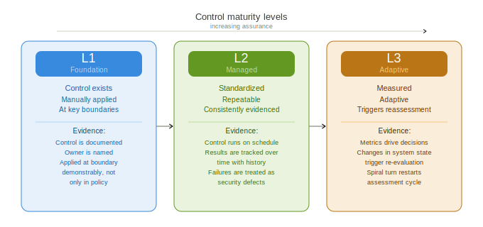
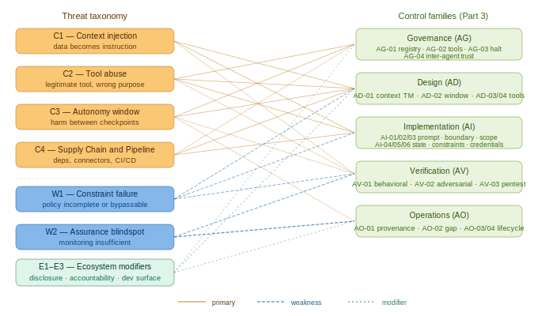

# Agentic SAMM — An OWASP SAMM Extension for AI-Driven Development

> **Author:** Sergey Gordeychik · CyberOK · scadastrangelove@gmail.com · 2026
> **License:** [CC BY-SA 4.0](LICENSE.md) — cite as: Gordeychik, S. (2026). *Agentic SAMM*. CyberOK.

---

# Part 3 — Shared Control Reference

This section defines all controls across the five SAMM function families. Each control has:

- A unique identifier (family + number)
- The SAMM function it maps to
- Threat classes addressed
- Three maturity levels (L1, L2, L3)
- Evidence criteria for each level
- Implementation guidance

**Control IDs are stable across versions.** Additions use new IDs; existing IDs are never reassigned.

**v0.2 additions:** AI-04 (Self-Modification Governance), AI-05 (Operational Value Constraints). AG-01 extended for dynamic agent graphs.

---


*Figure 4: L1 — manual and intentional; L2 — standardized and repeatable; L3 — measured and adaptive.*

---

## 3.1 Evidence vs. Process

A control is not at L2 because a process description exists. A control is at L2 when the evidence column is satisfied. The distinction matters because agentic systems are often *designed* more carefully than classical systems — design documents, architecture reviews, and policy artifacts tend to be thorough — while *operational evidence* of what the system actually does at runtime is thin.

**Evidence quality is not binary.** The framework recognizes six evidence states. Evidence quality determines the maximum grade achievable for a control.

```
[empirical]          — verified by running a test, command, or direct observation
[empirical absence]  — tested and confirmed NOT present; stronger than [unknown]
[config]             — stated in configuration, system prompt, or documentation
[inferred]           — logical conclusion without direct verification
[not testable]       — cannot be verified in this audit scope; state why
[unknown]            — not tested; no basis for assessment
```

Grade caps: L1 requires minimum [config] evidence. L2 requires [empirical] or [config] with corroborating [inferred]. L3 requires [empirical] plus measurement artifacts. **Self-report is [inferred] by default.**

**Structural controls:**
An architectural property of the platform (e.g., "one response = one checkpoint" in a chat interface, container isolation by the hosting provider) is labeled **L2-structural** when it meets the L2 evidence bar. L2-structural controls count toward security posture assessment but do not count toward program maturity — they exist without design or maintenance effort, and they can disappear without warning when vendor platform properties change.

**Shared responsibility:**
For cloud-hosted agent environments, split the control matrix into user-side (auditable directly), vendor-side (audited via attestation), and structural (architectural properties). A high vendor-attested grade does not compensate for a low user-side grade on the same control. See Part 0 §0.7.

---

## Family AG — Governance

### AG-01 Agent Registry

**SAMM function:** Governance
**Threat coverage:** C1, C3 (temporal blast radius), W1
**Audit track:** A, B, C

An agent registry is the foundational control from which all other controls depend. You cannot assess blast radius, review tool assignments, implement kill switches, or run behavioral tests against agents that are not enumerated.

**Dynamic agent graphs (v0.2):** Systems where agents can spawn subagents (Claude Code Agent tool, multi-agent orchestrators) require explicit handling. Spawned agents are not in the registry at spawn time, yet they inherit the parent's tool grants and blast radius. The spawning capability itself must be classified.

| Level | Implementation |
|---|---|
| L1 | Registry exists; each agent identified by name, type (LLM / subprocess / tool-driven / hybrid), owner, and autonomy level; reviewed at least once |
| L2 | Registry actively maintained; trust rating (per §0.5) assigned per agent; autonomy level bounded by trust rating; reassessment triggered on change; if subagent spawning is possible: spawning capability classified, spawning events logged, spawned agent tool surface bounded by parent authorization |
| L3 | Automated inventory; drift alerts when agents appear outside registry; dynamic trust rating updates based on behavioral telemetry |

**Evidence:**
- L1: registry document, agent list, initial review date
- L2: trust ratings with basis, reassessment log, subagent spawning policy (if applicable)
- L3: drift detection alert log, automated rating updates with behavioral basis

---

### AG-02 Tool Registry

**SAMM function:** Governance
**Threat coverage:** C2, C4

| Level | Implementation |
|---|---|
| L1 | Registry of tools available to each agent; each tool identified with name, type, access scope (read / write / exec / network), and owner |
| L2 | Trust rating per tool (§0.5); version pinning for security-critical tools; supply chain check (hash, signature, or provenance); dynamic tool expansion documented if applicable |
| L3 | Automated tool surface monitoring; alerts on tool additions outside registry; behavioral tests per tool on addition |

**Evidence:**
- L1: tool registry document with all fields populated
- L2: trust ratings, version pins, supply chain verification log
- L3: monitoring alert log, per-tool behavioral test suite

---

### AG-03 Kill Switch

**SAMM function:** Governance
**Threat coverage:** C3

| Level | Implementation |
|---|---|
| L1 | Halt mechanism exists and is documented; named owner; tested at least once; result recorded |
| L2 | Partial halt capability (specific tools or scope, not only full session); escalation path documented; test schedule defined |
| L3 | Automated anomaly detection triggers halt; halt events integrated into incident response pipeline |

**Evidence:**
- L1: halt mechanism description, test date and result, owner name
- L2: partial halt demonstration, escalation documentation
- L3: automated trigger configuration, integration with IR pipeline

---

## Family AD — Design

### AD-01 Context Threat Model

**SAMM function:** Design
**Threat coverage:** C1, W2

| Level | Implementation |
|---|---|
| L1 | Context sources enumerated with trust levels; at least one C1 threat path identified and documented |
| L2 | Full context flow diagram; all external/untrusted sources identified with sanitization status; threat model reviewed at each new context source addition |
| L3 | Automated context provenance tracking; anomaly detection on context source trust violations |

---

### AD-02 Autonomy Window Assessment

**SAMM function:** Design
**Threat coverage:** C3, W1

The autonomy window assessment must be per operating mode. A system that has three modes — interactive, loop, and scheduled — must assess each separately. Aggregate assessment is not valid.

**Blast radius must be derived from a mission model**, not from technical inventory alone. The mission interview (Part 2 §2.1 and audit/auditor-process.md Phase 1) must precede the blast radius matrix. Without a mission model, blast radius defaults to generic severity labels that do not map to actual owner risk.

| Level | Implementation |
|---|---|
| L1 | Autonomy window defined per operating mode; blast radius estimated per mode; hard limit defined for highest-blast mode |
| L2 | Blast radius derived from owner mission interview; behavioral-only constraints on mission-critical boundaries identified and documented as such; limits enforced, not just documented |
| L3 | Blast radius continuously measured; autonomy window auto-adjusts based on real-time blast radius telemetry |

**Evidence:**
- L1: per-mode autonomy window table, hard limit configuration
- L2: mission interview record, blast radius matrix with owner derivation, behavioral-only constraint inventory with risk acceptance
- L3: blast radius measurement pipeline, auto-adjustment configuration

---

### AD-03 Tool Trust Model

**SAMM function:** Design
**Threat coverage:** C2, C4

| Level | Implementation |
|---|---|
| L1 | Tool trust model defined; each tool has a trust rating (§0.5); trust enforcement semantics documented |
| L2 | Per-task scope limitation (not fixed session-wide authority); trust ratings enforced at invocation time |
| L3 | Real-time trust enforcement with automated scope narrowing based on task context |

---

### AD-04 Dev Surface Threat Model

**SAMM function:** Design
**Threat coverage:** C4, W2

| Level | Implementation |
|---|---|
| L1 | Development environment threat model exists; execution boundary, filesystem access, network access, and secret access documented |
| L2 | Pipeline position documented; trust level of each stage's outputs for the next stage defined; data classification for inputs into each AI tool defined |
| L3 | Automated dev surface scanning; drift alerts on new access paths |

---

## Family AI — Implementation

### AI-01 Prompt and Config Security

**SAMM function:** Implementation
**Threat coverage:** C1, W1

| Level | Implementation |
|---|---|
| L1 | System prompts, tool schemas, MCP definitions, and policy artifacts identified as security-critical; under version control |
| L2 | Changes reviewed through same process as application code; automated check for prompt injection patterns in user-supplied content |
| L3 | Prompt integrity verification at deploy time; behavioral regression tests run on prompt changes |

---

### AI-02 Execution Boundary

**SAMM function:** Implementation
**Threat coverage:** C2, C3

**Platform safety vs workflow safety:** AI-02 grades execution boundary controls (platform safety). Workflow safety — the risk profile of the actual usage pattern — is a separate dimension. A high platform safety grade does not compensate for a low workflow safety posture. Both must be assessed and reported separately. See Part 0 §0.6.

| Level | Implementation |
|---|---|
| L1 | Execution boundary defined; filesystem and network access per tool documented |
| L2 | Isolated execution enforced at runtime ([empirical] required); irreversible or high-blast actions require narrower scope or stronger checkpoint; residual risks documented after sandbox controls |
| L3 | Continuous boundary validation; automated escape path testing at each tool addition |

**Evidence:**
- L2: empirical test results for boundary enforcement (not documentation alone)
- L3: automated boundary test suite with results

---

### AI-03 Tool Authorization

**SAMM function:** Implementation
**Threat coverage:** C2

| Level | Implementation |
|---|---|
| L1 | Allow/deny policy for tools defined; per-task scope documented if available |
| L2 | Per-task scope enforced (not session-wide authority); explicit approval for actions above defined blast radius threshold |
| L3 | Dynamic scope issuance; automated narrowing; approval workflow integrated with action provenance log |

---

### AI-04 Agent Self-Modification Governance *(v0.2 — new control)*

**SAMM function:** Implementation
**Threat coverage:** C1, W1
**Audit track:** A, B

Any agent capability to write data that influences its own future behavior — persistent memory, scratch files, project instructions, system prompt extensions — creates a self-modification surface with cross-session blast radius. This surface is not covered by tool registry or execution boundary controls. A wrong architectural assumption written to cross-session memory propagates silently across all subsequent sessions without triggering any existing control.

Self-modification surfaces that the user cannot audit must be treated as L0 regardless of agent self-report.

| Level | Implementation |
|---|---|
| L1 | All self-modification surfaces enumerated; cross-session flag noted per surface; user-auditable mechanism exists for each (view command, UI panel, API export) |
| L2 | Writes logged with provenance (which session, which tool call, what was written); high-blast-radius writes (architectural assumptions, operational rules) require explicit user checkpoint before taking effect; user receives notification for any autonomous write |
| L3 | Automated anomaly detection on self-modification patterns; unrecognized writes generate alerts; periodic automated review of persistent state against ground truth |

**Evidence:**
- L1: enumeration document, user-auditable mechanism demonstration (view command output)
- L2: write log with provenance, checkpoint configuration, notification mechanism
- L3: anomaly detection configuration, automated review schedule and output

**Note on self-report ceiling:** All claims about what an agent "will not" write to persistent memory are [inferred] by default. L2 requires external logging or a user-auditable mechanism — not agent self-report. The only way to confirm current persistent state is to retrieve it via a user-auditable mechanism, not to ask the agent.

---

### AI-05 Operational Value Constraint Mapping *(v0.2 — new control)*

**SAMM function:** Implementation
**Threat coverage:** C3, W1
**Audit track:** A, B, C

Operational value constraints — mission boundaries the agent must not cross — are simultaneously ethical and security controls. "The scanner must not attack systems outside declared scope" is both an ethical statement and a C3 threat class with a specific blast radius. The framework must require explicit documentation and testing of these constraints.

The critical distinction this control forces: **"will not" vs "cannot."**

- *Technical enforcement (cannot):* the behavior is physically impossible — weight-level suppression, kernel-level control, scope enforcement that fails closed. This can be independently verified.
- *Behavioral enforcement (will not):* the behavior is governed by the model's alignment and reasoning. Can in principle be overridden by context manipulation or adversarial prompting. Identical self-report from aligned and misaligned agents.

For security tooling deployed to clients, a behavioral-only constraint on "the tool must not attack out-of-scope systems" is a materially different guarantee than a technical enforcement check. This difference must be surfaced, not implied.

| Level | Implementation |
|---|---|
| L1 | Mission-critical constraints documented with explicit enforcement type (technical / behavioral); blast radius if violated stated per constraint |
| L2 | Each constraint has a behavioral test case; behavioral-only constraints on mission-critical boundaries are formally risk-accepted by the system owner with documented rationale; technical enforcement exists for at least one highest-blast constraint |
| L3 | Automated adversarial testing for constraint violation scenarios at each release; behavioral-only constraints tracked as a security metric with trend monitoring |

**Evidence:**
- L1: constraint inventory with enforcement type and blast radius
- L2: behavioral test cases with pass/fail records, formal risk acceptance documentation with owner signature or equivalent
- L3: automated constraint test suite, metric dashboard

---

## Family AV — Verification

### AV-01 Behavioral Testing

**SAMM function:** Verification
**Threat coverage:** C1, C2, C3

| Level | Implementation |
|---|---|
| L1 | Behavioral test cases exist for primary threat classes (C1, C2); tests run before production; results documented |
| L2 | Behavioral tests integrated into CI; coverage tracks primary threat scenarios per operating mode; regression tracking |
| L3 | Adversarial test generation; automated coverage expansion; behavioral test results feed trust rating updates |

---

### AV-02 Adversarial Testing

**SAMM function:** Verification
**Threat coverage:** C1, C2, C3

| Level | Implementation |
|---|---|
| L1 | At least one adversarial test scenario per major threat class documented and executed; results recorded |
| L2 | Red team exercises covering prompt injection through context sources, tool abuse, and constraint bypass attempts; results feed control gap remediation |
| L3 | Continuous adversarial testing; automated injection scenario generation; results feed autonomous blast radius recalibration |

---

### AV-03 Penetration Testing Scope

**SAMM function:** Verification
**Threat coverage:** C1, C2, C3, C4

| Level | Implementation |
|---|---|
| L1 | Pentest scope explicitly includes agent loop, MCP servers, and tool surface (not only application endpoints) |
| L2 | Prompt injection and tool abuse scenarios in pentest methodology; development toolchain included in scope |
| L3 | Annual red team exercise covering full agentic stack including context sources, memory, and connector layer |

---

## Family AO — Operations

### AO-01 Action Logging

**SAMM function:** Operations
**Threat coverage:** W2

| Level | Implementation |
|---|---|
| L1 | Agent actions logged; logs accessible to user or security team; retention defined |
| L2 | Structured action provenance log including: context source and trust level, tool selected, approval event, scope exercised, sandbox policy applied; ingested into security monitoring pipeline |
| L3 | Real-time anomaly detection on action patterns; automated alert on trust level violations or out-of-scope actions |

---

### AO-02 Intent-Action Gap Monitoring

**SAMM function:** Operations
**Threat coverage:** W1, W2

| Level | Implementation |
|---|---|
| L1 | Agent declares plan before tool execution; user can compare declared plan to actual tool calls within session |
| L2 | Plan-vs-action divergence tracked; persistent divergences flagged for review; divergence rate measured per session |
| L3 | Automated intent-action gap detection; divergences above threshold trigger autonomous session halt |

---

### AO-03 Reassessment Triggers

**SAMM function:** Operations
**Threat coverage:** C4, W2

| Level | Implementation |
|---|---|
| L1 | Trigger list defined: new tool added, system prompt changed, new downstream system, anomalous behavior observed |
| L2 | Triggers monitored automatically; reassessment procedure documented; last reassessment date tracked per agent |
| L3 | Automated trigger detection; reassessment initiated automatically; results feed trust rating updates |

---

### AO-04 Behavioral Vulnerability Tracking

**SAMM function:** Operations
**Threat coverage:** W1, W2

| Level | Implementation |
|---|---|
| L1 | Behavioral vulnerabilities tracked separately from code vulnerabilities; each linked to a threat class and blast radius estimate |
| L2 | Behavioral vulns linked to behavioral test cases; remediation SLA defined; closure requires test demonstrating HOLDS |
| L3 | Behavioral vulnerability metrics published internally; trend data feeds autonomy expansion decisions |

---

## Summary table

| Control | Family | SAMM function | v0.2 change |
|---|---|---|---|
| AG-01 | Governance | Governance | Extended: dynamic agent graphs |
| AG-02 | Governance | Governance | — |
| AG-03 | Governance | Governance | — |
| AD-01 | Design | Design | — |
| AD-02 | Design | Design | Extended: mission model requirement |
| AD-03 | Design | Design | — |
| AD-04 | Design | Design | — |
| AI-01 | Implementation | Implementation | — |
| AI-02 | Implementation | Implementation | Extended: platform/workflow safety separation |
| AI-03 | Implementation | Implementation | — |
| **AI-04** | **Implementation** | **Implementation** | **New: Self-Modification Governance** |
| **AI-05** | **Implementation** | **Implementation** | **New: Operational Value Constraints** |
| AV-01 | Verification | Verification | — |
| AV-02 | Verification | Verification | — |
| AV-03 | Verification | Verification | — |
| AO-01 | Operations | Operations | — |
| AO-02 | Operations | Operations | — |
| AO-03 | Operations | Operations | — |
| AO-04 | Operations | Operations | — |


*Figure 6: Threat taxonomy classes mapped to the controls that address them.*

---

## 3.3 Framework Mapping

Control IDs are stable across minor versions of this framework. The mapping is directional — it shows functional alignment, not clause-level equivalence.

| Control ID | SAMM Function | NIST AI RMF | NCSC Secure AI | MCP Security Spec |
|---|---|---|---|---|
| AG-01 | Governance | GOVERN 1.1, 1.2 | Principle 1 (Secure design) | — |
| AG-02 | Governance | GOVERN 2.2 | Principle 3 (Secure build) | Security Best Practices §3 |
| AG-03 | Governance | GOVERN 1.7 | Principle 6 (Secure operation) | — |
| AD-01 | Design | MAP 1.5, 2.2 | Principle 1 (Secure design) | — |
| AD-02 | Design | MAP 2.3 | Principle 1 (Secure design) | — |
| AD-03 | Design | MAP 1.5 | Principle 1 (Secure design) | Security Best Practices §2 |
| AD-04 | Design | MAP 1.5 | Principle 1 (Secure design) | Security Best Practices §4 |
| AI-01 | Implementation | MANAGE 1.3 | Principle 3 (Secure build) | — |
| AI-02 | Implementation | MANAGE 1.3 | Principle 5 (Secure deployment) | Security Best Practices §5 |
| AI-03 | Implementation | MANAGE 1.3 | Principle 3 (Secure build) | Security Best Practices §3 |
| AI-04 | Implementation | GOVERN 6.2 | Principle 1 (Secure design) | Security Best Practices §4 |
| AI-05 | Implementation | GOVERN 1.1 | Principle 6 (Maintain security posture) | Security Best Practices §2 |
| AV-01 | Verification | MEASURE 2.6 | Principle 4 (Secure evaluation) | — |
| AV-02 | Verification | MEASURE 2.6, 2.7 | Principle 4 (Secure evaluation) | — |
| AV-03 | Verification | MEASURE 2.7 | Principle 4 (Secure evaluation) | — |
| AO-01 | Operations | MEASURE 2.8 | Principle 6 (Secure operation) | Security Best Practices §6 |
| AO-02 | Operations | MEASURE 2.8 | Principle 6 (Secure operation) | — |
| AO-03 | Operations | GOVERN 1.7 | Principle 6 (Secure operation) | — |
| AO-04 | Operations | MANAGE 2.4 | Principle 6 (Secure operation) | — |

---

## 3.4 Agentic Vulnerability Lifecycle

Classical vulnerability lifecycle assumes a code defect with a CVE identifier, a patch, and a deployment window. For agentic systems, this model is incomplete in three ways: behavioral vulnerabilities have no CVE equivalent; the window between disclosure and weaponization is compressed by AI-assisted exploit development; and the "fix" may be a constraint update rather than a code change.

The following lifecycle applies to behavioral and constraint-level vulnerabilities in agentic systems.

**Discovery**
A behavioral vulnerability may be discovered through adversarial evaluation, production incident, intent–action gap monitoring, or external report. Unlike code vulnerabilities, behavioral vulnerabilities are often discovered through observed unsafe behavior rather than static analysis. Discovery must be accepted from non-CVE sources.

**Reproduction**
Reproduce the unsafe behavior in a controlled environment. Document the triggering context, the tool invocation sequence, the constraint or policy that failed, and the outcome. Reproduction confirms that the finding is real and scopes the blast radius.

**Behavioral classification**
Classify the finding against the threat taxonomy: which primary threat class does it exploit (C1–C4), which weakness overlay enabled it (W1 constraint failure, W2 assurance blindspot), and which ecosystem modifier affects urgency. Classification determines remediation approach and priority.

**Containment**
Apply immediate controls to reduce blast radius while permanent remediation is developed. Containment may include: restricting the relevant tool, reducing autonomy window, adding an explicit approval checkpoint, or disabling the context source that carried the injection payload.

**Remediation**
Remediation for a behavioral vulnerability is typically one or more of: constraint update (tighten policy or guardrails), tool scope reduction, context source trust reclassification, or behavioral test addition that would have caught the finding. Code changes may also be required but are often not sufficient alone.

**Regression verification**
Verify that the behavioral test suite now catches the finding. A remediated behavioral vulnerability with no regression test is treated as partially closed. The regression test becomes a permanent member of the behavioral test suite.

**Spiral reassessment**
A closed behavioral vulnerability is a reassessment trigger. Review: does this finding indicate a constraint gap that affects other agents or tools, does it change the autonomy window or blast radius assessment, and does it require updates to the threat model or tool registry governance.

**A note on disclosure compression**
For agentic systems, the interval between public disclosure of a behavioral attack pattern and its adoption in active exploitation may be very short. Teams should treat novel behavioral attack classes — new prompt injection techniques, new tool abuse patterns — with the urgency of a critical CVE even when no CVE exists. The absence of a CVE identifier does not indicate low severity.
