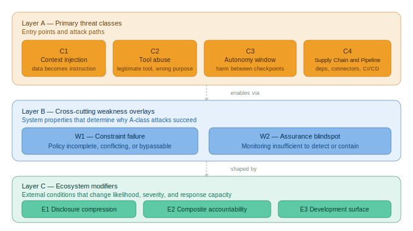

# Agentic SAMM — An OWASP SAMM Extension for AI-Driven Development

> **Author:** Sergey Gordeychik · CyberOK · scadastrangelove@gmail.com · 2026
> **License:** [CC BY-SA 4.0](LICENSE.md) — cite as: Gordeychik, S. (2026). *Agentic SAMM*. CyberOK.

---

# Agentic Threat Taxonomy

*Standalone reference. For full context see [Part 0](part0-foundations.md).*

*Figure 2: The taxonomy separates attack paths (Layer A), system weaknesses that enable them (Layer B), and ecosystem conditions that modify their severity (Layer C).*